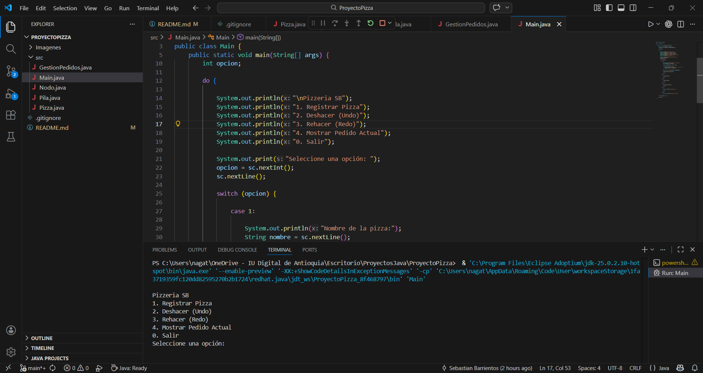
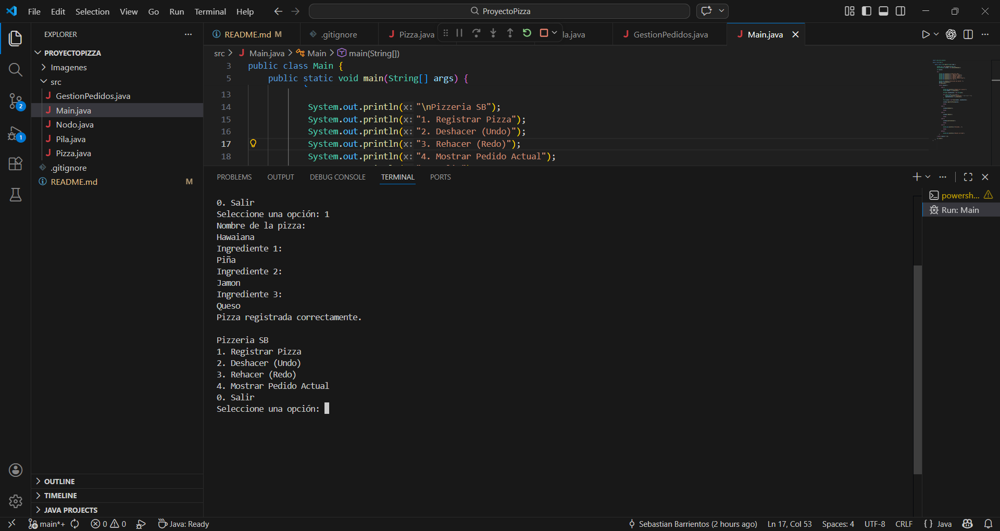
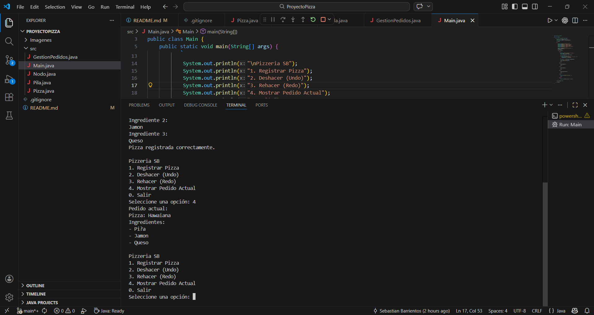
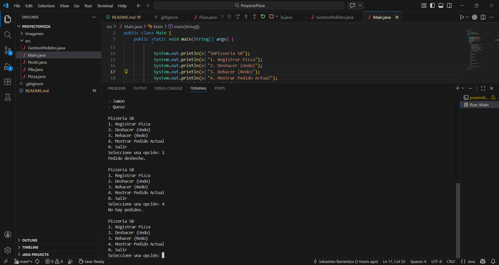
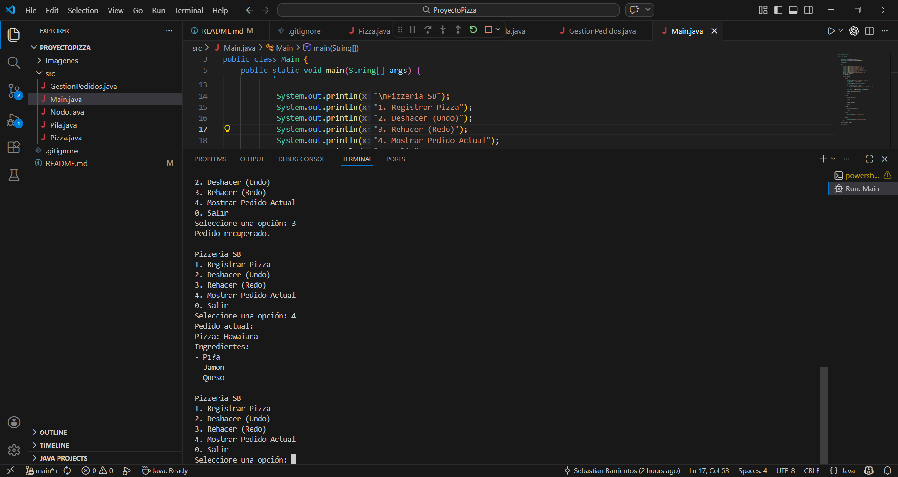
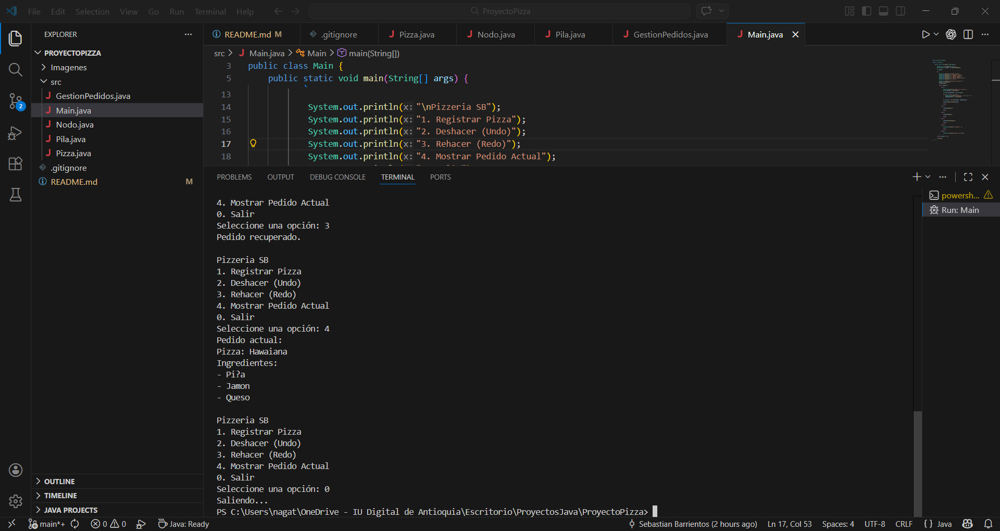

# ProyectoPizza

Simulador de gestión de pedidos para una pizzería desarrollado en Java.  
Este proyecto implementa la estructura de datos **Pila (Stack)** utilizando **listas ligadas**, permitiendo simular un sistema de **Undo / Redo** para gestionar pedidos.

## Autor

Sebastián Barrientos

## Descripción del proyecto

Este programa simula el sistema de pedidos de una pizzería.  
Permite registrar pedidos y administrar las acciones realizadas mediante el uso de pilas.

El sistema permite:

- Agregar pedidos de pizza
- Deshacer el último pedido (Undo)
- Rehacer un pedido deshecho (Redo)
- Mostrar los pedidos actuales

El objetivo del proyecto es demostrar el funcionamiento de la estructura de datos **pila** aplicada a un caso práctico.

## Estructura del proyecto

ProyectoPizza
│
├── src
│ ├── Pizza.java
│ ├── Nodo.java
│ ├── Pila.java
│ ├── GestionPedidos.java
│ └── Main.java
│
├── README.md
└── .gitignore

## Explicación de las clases

**Pizza.java**  
Representa un pedido de pizza con sus atributos.

**Nodo.java**  
Implementa el nodo de una lista ligada que será utilizada por la pila.

**Pila.java**  
Implementación manual de la estructura de datos **Pila (Stack)** usando nodos.

**GestionPedidos.java**  
Controla la lógica del sistema de pedidos y maneja las pilas para **Undo y Redo**.

**Main.java**  
Contiene el menú interactivo que permite al usuario usar el sistema desde la consola.

## Funcionamiento del sistema Undo / Redo

El sistema utiliza **dos pilas**:

**Pila Undo**
- Guarda los pedidos realizados
- Permite deshacer la última acción

**Pila Redo**
- Guarda los pedidos deshechos
- Permite rehacer acciones previamente deshechas

Esto simula el comportamiento de aplicaciones reales que permiten deshacer y rehacer acciones.

## Cómo ejecutar el programa

1. Abrir la carpeta del proyecto en **VS Code**

2. Ir a la carpeta `src`

3. Compilar el programa

javac *.java

4. Ejecutar el programa

java Main

Tecnologías utilizadas

- Java
- Git
- GitHub
- Visual Studio Code

## Objetivo académico

Este proyecto fue desarrollado como actividad académica para comprender el uso de **estructuras de datos**, específicamente la **pila**, y su aplicación en sistemas reales mediante la simulación de un gestor de pedidos con funcionalidad **Undo/Redo**.

## Capturas de ejecución

### Menu principal

### Registrar pizza

### Mostrar pedido actual

### Deshacer pedido (Undo)

### Rehacer pedido (Redo)

### Salir del programa (Redo)

## Video de sustentación

Link del video: https://youtu.be/EnKy_um0RRE